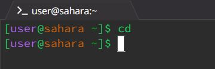

# CSE 15L Lab 1 Report 
##### due on Tuesday, January 16 by 10pm

## Workspace Commands
cd
--
* Share an example of using the command with no arguments.
  * A screenshot or Markdown code block showing the command and its output
    > 
  * What the working directory was when the command was run
    > /home
  * A sentence or two explaining why you got that output (e.g. what was in the filesystem, what it meant to have no arguments).
    > The output is observed because cd specifically is used to switch the current working directory to a given specified path. No path was provided to cd in the argument, so as a result, no output was generated or observed
  * Indicate whether the output is an error or not, and if it's an error, explain why it's an error.
    > This is not an error and is the expected output
* Share an example of using the command with a path to a directory as an argument.
  * A screenshot or Markdown code block showing the command and its output
  * What the working directory was when the command was run
  * A sentence or two explaining why you got that output (e.g. what was in the filesystem, what it meant to have no arguments).
  * Indicate whether the output is an error or not, and if it's an error, explain why it's an error.
* Share an example of using the command with a path to a file as an argument.
  * A screenshot or Markdown code block showing the command and its output
  * What the working directory was when the command was run
  * A sentence or two explaining why you got that output (e.g. what was in the filesystem, what it meant to have no arguments).
  * Indicate whether the output is an error or not, and if it's an error, explain why it's an error.

ls
--
* Share an example of using the command with no arguments.
  * A screenshot or Markdown code block showing the command and its output
  * What the working directory was when the command was run
  * A sentence or two explaining why you got that output (e.g. what was in the filesystem, what it meant to have no arguments).
  * Indicate whether the output is an error or not, and if it's an error, explain why it's an error.
* Share an example of using the command with a path to a directory as an argument.
  * A screenshot or Markdown code block showing the command and its output
  * What the working directory was when the command was run
  * A sentence or two explaining why you got that output (e.g. what was in the filesystem, what it meant to have no arguments).
  * Indicate whether the output is an error or not, and if it's an error, explain why it's an error.
* Share an example of using the command with a path to a file as an argument.
  * A screenshot or Markdown code block showing the command and its output
  * What the working directory was when the command was run
  * A sentence or two explaining why you got that output (e.g. what was in the filesystem, what it meant to have no arguments).
  * Indicate whether the output is an error or not, and if it's an error, explain why it's an error.

cat
--
* Share an example of using the command with no arguments.
  * A screenshot or Markdown code block showing the command and its output
  * What the working directory was when the command was run
  * A sentence or two explaining why you got that output (e.g. what was in the filesystem, what it meant to have no arguments).
  * Indicate whether the output is an error or not, and if it's an error, explain why it's an error.
* Share an example of using the command with a path to a directory as an argument.
  * A screenshot or Markdown code block showing the command and its output
  * What the working directory was when the command was run
  * A sentence or two explaining why you got that output (e.g. what was in the filesystem, what it meant to have no arguments).
  * Indicate whether the output is an error or not, and if it's an error, explain why it's an error.
* Share an example of using the command with a path to a file as an argument.
  * A screenshot or Markdown code block showing the command and its output
  * What the working directory was when the command was run
  * A sentence or two explaining why you got that output (e.g. what was in the filesystem, what it meant to have no arguments).
  * Indicate whether the output is an error or not, and if it's an error, explain why it's an error.

