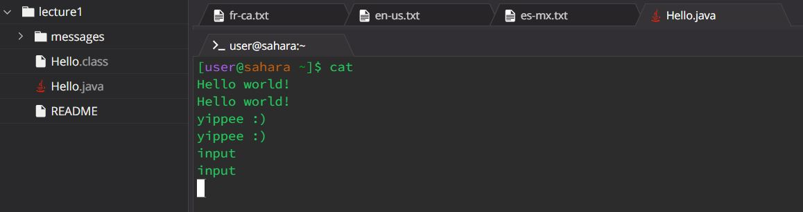

# CSE 15L Lab 1 Report 
### by Marina Hu (W24 A02 Section)
#### due on Tuesday, January 16 by 10 PM

## Workspace Commands

`cd`
--
* Share an example of using the command with no arguments.
  * A screenshot or Markdown code block showing the command and its output
    > 
  * What the working directory was when the command was run
    > The working directory of the `cd` command with no arguments is `/home`.
  * A sentence or two explaining why you got that output (e.g. what was in the filesystem, what it meant to have no arguments).
    > The output is observed because `cd` specifically is used to switch the current working directory to a given specified path. When no argument is provided, it assumes that the working directory to switch into would be `/home` as it is the default directory. This allows the user to easily navigate back to their home directory. This is more clear if we first used `cd lecture1/` to get into the lecture1 folder directory, and then used just `cd` with no arguments. We can see that it brings the user right back to the `/home`.
  * Indicate whether the output is an error or not, and if it's an error, explain why it's an error.
    > This is not an error and is the expected output.

* Share an example of using the command with a path to a directory as an argument.
  * A screenshot or Markdown code block showing the command and its output
    > 
  * What the working directory was when the command was run
    > The working directory of the `cd` command with a path to a directory as an argument is `/home/lecture1`.
  * A sentence or two explaining why you got that output (e.g. what was in the filesystem, what it meant to have no arguments).
    > `cd` specifically is used to switch the current working directory to a given specified path. A path to lecture1 has been specified, so now the working directory of the prompt is `/home/lecture1`.
  * Indicate whether the output is an error or not, and if it's an error, explain why it's an error.
    > This is not an error and is the expected output.

* Share an example of using the command with a path to a file as an argument.
  * A screenshot or Markdown code block showing the command and its output
      > 
  * What the working directory was when the command was run
    > In the first time `cd Hello.java` was used, the working directory is `/home`.
    > In the second time `cd Hello.java` was used, the working directory is `/home/lecture1`.
  * A sentence or two explaining why you got that output (e.g. what was in the filesystem, what it meant to have no arguments).
    > For the first time `cd Hello.java`, the error was produced because `Hello.java` isn't a file or directory or path that is present within `/home`.
    > 
    > For the second time `cd Hello.java`, now we have switched to the path that contains `Hello.java`, thus the file does exist; however, `Hello.java` is a file and not a directory or path. `cd` requires specifying a desired path or directory to go to.
  * Indicate whether the output is an error or not, and if it's an error, explain why it's an error.
    > This is actually an error. `cd` is designed to change the current working directory to a specified one provided in the argument, so the command was expecting a valid directory. By providing a file name, `cd` is trying to change to a directory that doesn't exist or isn't accessible. Thus the output observed is an error message as it's telling the user  that the file provided in the argument either isn't present in the working directory or just isn't a directory at all. 

`ls`
--
* Share an example of using the command with no arguments.
  * A screenshot or Markdown code block showing the command and its output
    >
  * What the working directory was when the command was run
    > The working directory when `ls` is used with no argument is `/home`.
  * A sentence or two explaining why you got that output (e.g. what was in the filesystem, what it meant to have no arguments).
    > The above outputs were observed because, within the `/home` working directory, the only file and/or folder to exist is the printed lecture1 folder, thus that is the only folder listed when the `ls` command is run without any additional arguments.
  * Indicate whether the output is an error or not, and if it's an error, explain why it's an error.
    >These are all the expected outputs, and none of the above commands produced unexpected errors.

 
* Share an example of using the command with a path to a directory as an argument.
  * A screenshot or Markdown code block showing the command and its output
    >
  * What the working directory was when the command was run
    > For the `ls lecture1/` command, the working directory is `/home`.
    >
    > For the `ls messages/` command, the working directory is `/home/lecture1`.
  * A sentence or two explaining why you got that output (e.g. what was in the filesystem, what it meant to have no arguments).
    > For the `ls lecture1/` command, the results were observed because within the lecture1 folder in the working directory of `/home`, three files (`Hello.class`, `Hello.java`, and `README`) and one folder (`messages`) are present.
    >
    > For the `ls messages/` command, the results were observed because within the messages folder in the working directory of `/home/lecture1`, four txt files (`en-us.txt`, `es-mx.txt`, `fr-ca.txt`, `zh-cn.txt`) are present.
  * Indicate whether the output is an error or not, and if it's an error, explain why it's an error.
    > These are all the expected outputs, and none of the above commands produced unexpected errors.

 
* Share an example of using the command with a path to a file as an argument.
  * A screenshot or Markdown code block showing the command and its output
    >
  * What the working directory was when the command was run
    > Initially in the first `ls Hello.java`, the working directory is `/home`.
    >
    > Then with the second `ls Hello.java` and the first `ls en-us.txt` and the first `ls en-us`, the working directory is `/home/lecture1`. This is relevant to the ls command as it explains the different outputs we observed for each command despite being in the same working directory. 
    >
    > Finally with the second `ls en-us.txt` (no second `ls en-us` was included because this will produce an error stating that no such file or directory can be accessed, which is true because the file name is `en-us.txt` not just en-us), the working directory is `/home/lecture1/messages`.
  * A sentence or two explaining why you got that output (e.g. what was in the filesystem, what it meant to have no arguments).
    > With the first `ls Hello.java`, the result was observed because similar to when we used `cd` with a file passed as an argument, `Hello.java` isn't a file or directory or path that is present within `/home`.
    >
    > Then with the second `ls Hello.java`, because now we are in the working directory of `/home/lecture1`, "Hello.java" is printed as that file is indeed within the working directory now.
    >
    > With the first `ls en-us.txt` and first `ls en-us`, the error was produced because we are not in the directory or path where those files reside in.
    >
    > With the second `ls en-us.txt`, "en-us.txt" is printed because now we are in the working directory (`/home/lecture1/messages`) which that file is in.
  * Indicate whether the output is an error or not, and if it's an error, explain why it's an error.
    > All the above outputs were expected, and none were unexpected errors. All errors produced were expected. 

`cat`
--
* Share an example of using the command with no arguments.
  * A screenshot or Markdown code block showing the command and its output
    >
  * What the working directory was when the command was run
    > The working directory of the `cat` command when provided no arguments is `/home`.
  * A sentence or two explaining why you got that output (e.g. what was in the filesystem, what it meant to have no arguments).
    > For this command with no arguments, whatever the user types in the terminal becomes printed as the output. This is because, within the current working directory, there is no file for the command to read and print out the content. There is only a folder called lecture1. According to the [documentation](https://man7.org/linux/man-pages/man1/cat.1.html), it states that when `cat` is used with no files (as is the case here), it'll copy the standard input to standard output. In other words, when one types more commands, one ends up typing them into the `cat` command, so it'll output what one has provided as an input.
  * Indicate whether the output is an error or not, and if it's an error, explain why it's an error.
    > This is not an error and instead what is expected.

 
* Share an example of using the command with a path to a directory as an argument.
  * A screenshot or Markdown code block showing the command and its output
    >
  * What the working directory was when the command was run
    > The working directory of the `cat` command when it is provided a path to a directory as an argument is `/home` in the instance provided above in the picture.
  * A sentence or two explaining why you got that output (e.g. what was in the filesystem, what it meant to have no arguments).
    > The following output was produced because `cat` can only read files, not folders or directories. Because a folder/directory called lecture1 was provided, it outputs that, letting us know that lecture1 is a directory, and using cat will not read the contents of lecture1 as it is not a file. 
  * Indicate whether the output is an error or not, and if it's an error, explain why it's an error.
    > This is an error. `cat` is used to concatenate and display the content of files provided in the argument. When we gave `cat` a path to a directory instead as an argument, it checks if what we provided is a directory and doesn't attempt to read or display to contents of the directory.  

 
* Share an example of using the command with a path to a file as an argument.
  * A screenshot or Markdown code block showing the command and its output
    >
  * What the working directory was when the command was run
    > For the `cat Hello.java command`, the working directory is `/home`.
    >
    > For the `cat /home/lecture1/Hello.java` command, the working directory is also `/home`.
  * A sentence or two explaining why you got that output (e.g. what was in the filesystem, what it meant to have no arguments).
    > For the `cat Hello.java` command, the above error was observed because `Hello.java` isn't a file or directory or path that is present within `/home`.
    >
    > For the `cat /home/lecture1/Hello.java` command, because we have now directly provided the path to be `/home/lecture1/Hello.java`, the prompt is able to navigate to the exact file `Hello.java`, and thus it'll print out all the content of `Hello.java`.
  * Indicate whether the output is an error or not, and if it's an error, explain why it's an error.
    > This is not an error and instead what is expected.

