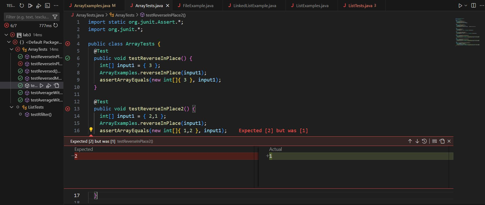
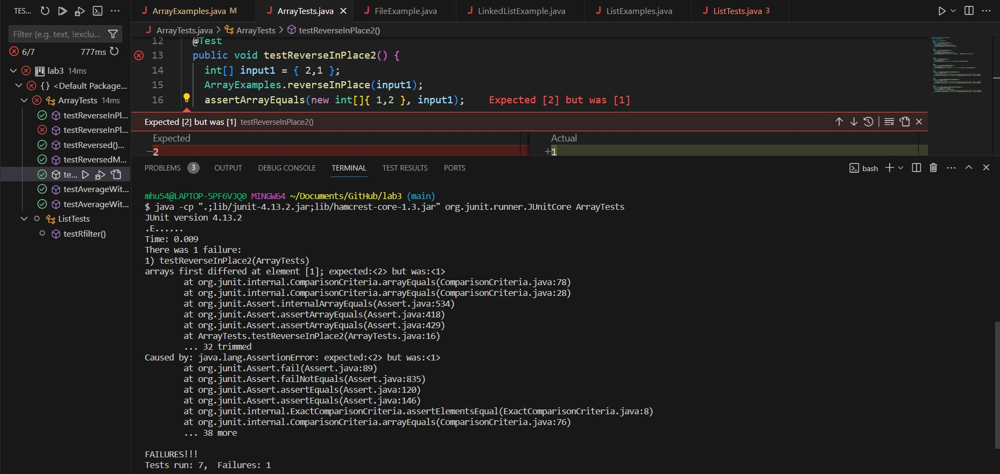
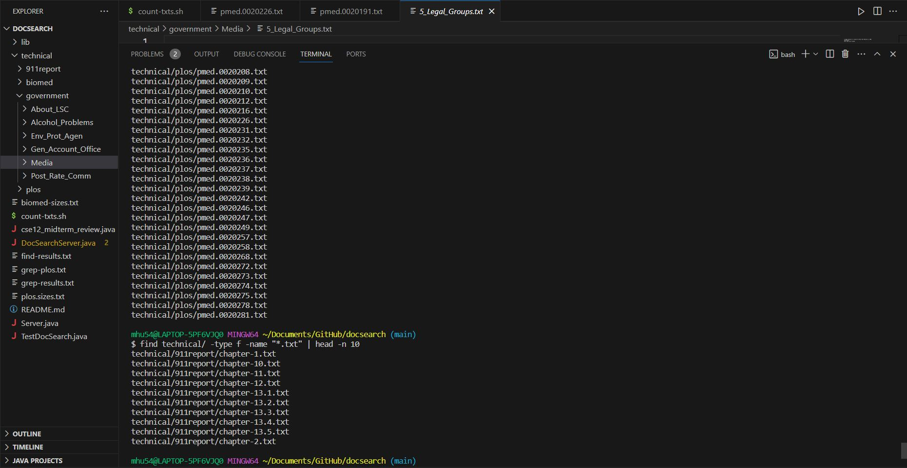
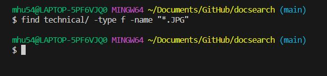
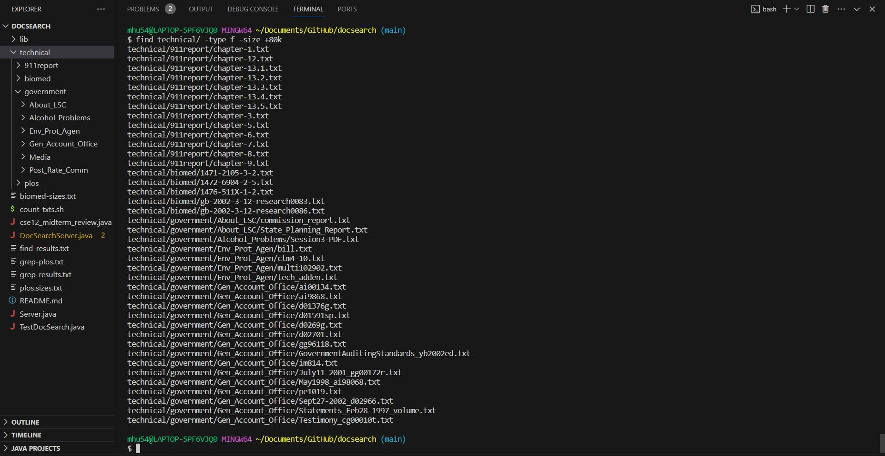
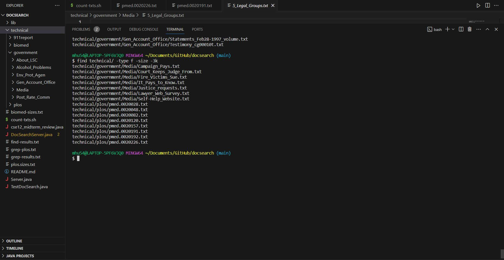
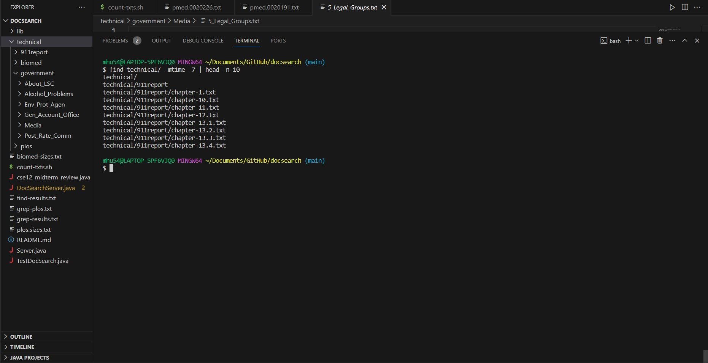
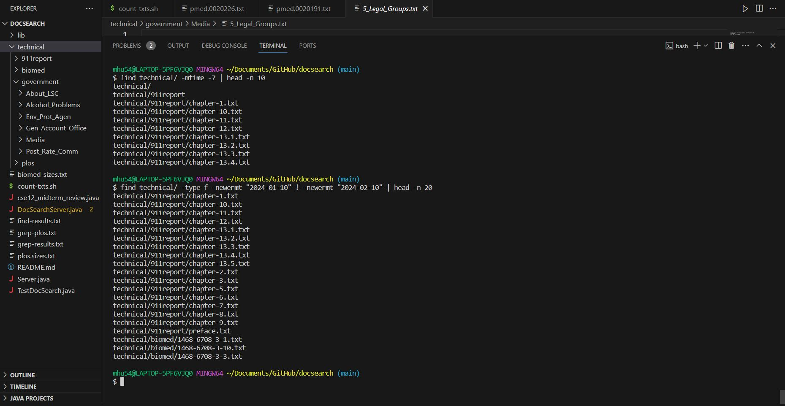
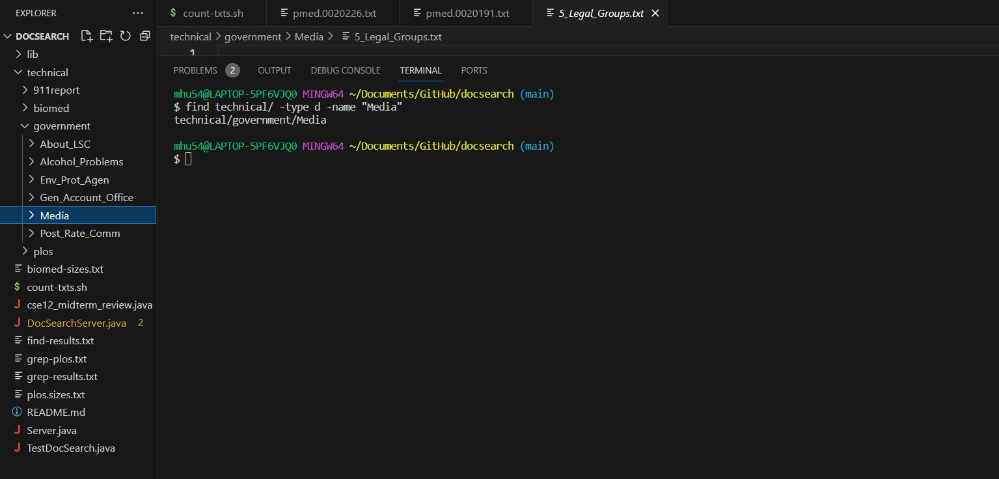
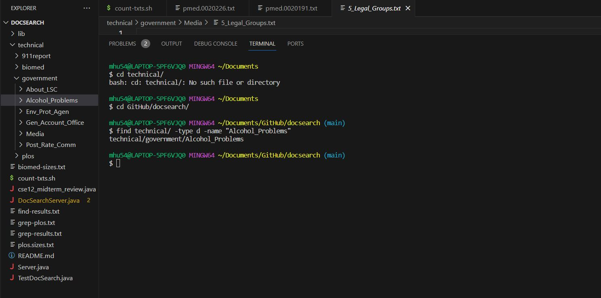

# CSE 15L Lab 3 Report 
### by Marina Hu (W24 A02 Section)
#### due on Tuesday, February 13 by 10 PM

Part 1 - Bugs
--
Choose one of the bugs from week 4's lab: Testing `reverseInPlace(int[] arr)`

- A failure-inducing input for the buggy program, as a JUnit test and any associated code (write it as a code block in Markdown)
  ```
  @Test
  public void testReverseInPlace2() {
    int[] input1 = { 2,1 };
    ArrayExamples.reverseInPlace(input1);
    assertArrayEquals(new int[]{ 1,2 }, input1);   // Expected [2] but was [1]
  }
  ```
- An input that doesn't induce a failure, as a JUnit test and any associated code (write it as a code block in Markdown)
  ```
  @Test 
	public void testReverseInPlace() {
    int[] input1 = { 3 };
    ArrayExamples.reverseInPlace(input1);
    assertArrayEquals(new int[]{ 3 }, input1);
	}
  ```
- The symptom, as the output of running the tests (provide it as a screenshot of running JUnit with at least the two inputs above)
  > 
  > 
  > 
- The bug, as the before-and-after code change required to fix it (as two code blocks in Markdown)
  > Before, Original code
  ```
  static void reverseInPlace(int[] arr) {
    // old
    for(int i = 0; i < arr.length; i += 1) {
      arr[i] = arr[arr.length - i - 1];
    }
  }
  ```
  > After, New Code
  ```
  for(int i = 0; i < arr.length/2; i += 1) {
      int temp = arr[i];
      arr[i] = arr[arr.length - i - 1];
      arr[arr.length - i - 1] = temp;
  }
  ```
- Briefly describe why the fix addresses the issue
  - In the old or original method, there was an issue with the for loop, thus making it unable to handle any array that's longer than a length of 2. The for loop does iterate through the entire array, but the new assignment was incorrect as with each iteration, it overwrites the elements in the array with elements from the reversed position. So for example, with the failure-inducing input with the old code, the test, rather than seeing `{1,2}`, saw `{1, 1}`, hence why it's returning an error message that it was expecting [2] but saw [1] instead at index = 1. Because of this bud, the first test passed as it was only a length of 1, so the for loop coincidentally worked out for it, but once the length increased, a failure input was induced.


Part 2 - Researching Commands
--
Command chosen to research: find

1. Can find files of a specific type
   > General formatting of command: `find /path/to/directory -type f -name "*.txt"`
   >
   > Source: OpenAI (2022), [ChatGPT (November 30 version)](https://chat.openai.com/chat)
   >
   > With technical/, could use `find technical/ -type f -name "*.txt"` to find all the files that are txt files. It's looking through all the files (`-type f`) that are txt files (`-name "*.txt"`) in the technical/ directory. This can be particularly useful as this can be a separate way to find files that end with ".txt" rather than using grep to do so. The `| head -n 10` was added to the end to restrict the number of files listed, as there were a lot of files in technical/ that end with .txt, to just the first ten so that the image would be easier to capture.
   > 
   >
   > With technical/, could use `find technical/ -type f -name "*.JPG"` to find all the files that are txt files. It's looking through all the files (-type f) that are JPG files (-name "*.JPG") in the technical/ directory. This can be particularly useful as this allows users to quickly determine the files that are pictures and can also be a separate way to find files that end with ".JPG" rather than using grep to do so.
   > 
   > 
2. Can find files that are larger or smaller than a specific size
   > General formatting of command: `find /path/to/directory -type f -size (+/-)100M`
   >
   > Source: OpenAI (2022), [ChatGPT (November 30 version)](https://chat.openai.com/chat)
   >
   > With technical/, could use `find technical/ -type f -size +80k` to find all files (`-type f`) that are greater than 80 kilobytes (`-size +80k`). This can be particularly useful when one is building a potential software where the input is restricted by the file size given, so using this command line could be a quick way to find out which files are large or small enough to work for such software.  
   > 
   >
   > With technical/, could use `find technical/ -type f -size -3k` to find all files (`-type f`) that are less than 3 kilobytes (`-size -3k`). This again can be particularly useful when one is building a potential software where the input is restricted by the file size given, so using this command line could be a quick way to find out which files are large or small enough to work for such software.  
   > 
   > 
3. Can find files that were last modified in the last number of days or within a time period
   > General formatting of command: `find /path/to/directory -mtime -(number of days)` or `find /path/to/directory -type f -newermt "starting_date" ! -newermt "ending_date"`
   >
   > Source: OpenAI (2022), [ChatGPT (November 30 version)](https://chat.openai.com/chat)
   >
   > With technical/, could use `find technical/ -mtime -7 ` to find all the files that were modified in the last seven days (`-mtime -7`). This can be particularly useful if one wants to quickly access or know information about files that were most recently updated, resulting in potentially a change on their end with a code or some other software. The `| head -n 10` was added to the end to restrict the number of files listed, as there were a lot of files in technical/ that end with .txt, to just the first ten so that the image would be easier to capture.
   > 
   >
   > With technical/, could use `find technical/ -type f -newermt "2024-01-10" ! -newermt "2024-02-10"` to find all the files (`-type f`) that were modified between 01/10/2024 and 02/10/2024 (`-newermt "2024-01-10" ! -newermt "2024-02-10"`). This can again be particularly useful if one wants to quickly access or know information about files that were updated during a specific period, resulting in potentially a change on their end with a code or some other software. The `| head -n 20` was added to the end to restrict the number of files listed, as there were a lot of files in technical/ that end with .txt, to just the first 20 so that the image would be easier to capture.
   > 
   > 
4. Can find directories with a certain name
   > General formatting of command: `find /path/to/directory -type d -name "dirname"`
   >
   > Source: OpenAI (2022), [ChatGPT (November 30 version)](https://chat.openai.com/chat)
   >
   > With technical/, could use `find technical/ -type d -name "Media"` to find the directory of the `Media` directory. This could be more particularly useful when there are a lot of folders or directories, and so if one would like to quickly know where the specific Media directory is, they could use this command. Furthermore, if one was trying to find a directory but say they were in `Documents` instead, and they knew the `Media` directory somewhere in `GitHub`, this command (specifically `find GitHub/ -type d -name "Media"`) would be very useful in quickly identifying which directory `Media` lies in.  
   > 
   >
   > With technical/, could use `find technical/ -type d -name "Alcohol_Problems"` to find the directory of the `Alcohol_Problems` directory. This could be more particularly useful when there are a lot of folders or directories, and so if one would like to quickly know where the specific `Alcohol_Problems` directory is, they could use this command. Furthermore, if one was trying to find a directory but say they were in `Documents` instead, and they knew the `Alcohol_Problems` directory somewhere in `GitHub`, this command (specifically `find GitHub/ -type d -name "Alcohol_Problems"`) would be very useful in quickly identifying which directory `Alcohol_Problems` lies in.
   > 
   > 
