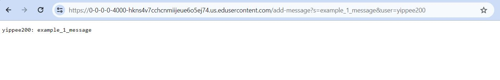
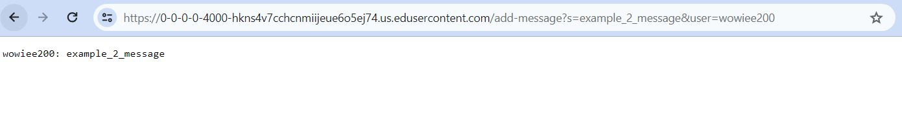
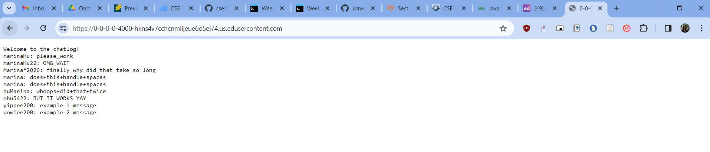

# CSE 15L Lab 2 Report 
### by Marina Hu (W24 A02 Section)
#### due on Tuesday, January 30 by 10 PM

Part 1
--
Code Written
ChatServer.java Code
`
import java.io.IOException;
import java.net.URI;
import java.util.ArrayList;

// THIS WORKS OMFG YAY
class Handler implements URLHandler {
    // The one bit of state on the server: a number that will be manipulated by
    // various requests.
    //str = new String [];
    ArrayList <String> chats = new ArrayList<>();
    int num = 0;
    String user = null;
    String message = null;

    public String handleRequest(URI url) {
        if (url.getPath().equals("/")) {
            String chatLog = "Welcome to the chatlog! \n";
            for (String chat : chats){
                chatLog += chat + "\n";
            }
            return chatLog;
        } 
        else if (url.getPath().equals("/add-message")){
            String[] parameters = url.getQuery().split("&");
            for (String parameter : parameters){
                String[] read = parameter.split("=");
                if (read.length == 2){
                    if(read[0].equals("s")){
                        message = read[1];
                    } else if (read[0].equals("user")){
                        user = read[1];
                    }
                }
            }

            if(user != null && message != null){
                String chatMessage = user +": " + message;
                chats.add(chatMessage);
                return chatMessage;
            } else{
                return "Invalid request format";
            }

        } else {
            // i don't think we need this part
            // if (url.getPath().contains("/add")) {
            //     String[] parameters = url.getQuery().split("=");
            //     if (parameters[0].equals("s")) {
            //         num += Integer.parseInt(parameters[1]);
            //         return String.format("Number increased by %s! It's now %d", parameters[1], num);
            //     }
            // }
            return "404 Not Found!";
        }
    }
}

class ChatServer {
    public static void main(String[] args) throws IOException {
        if(args.length == 0){
            System.out.println("Missing port number! Try any number between 1024 to 49151");
            return;
        }

        int port = Integer.parseInt(args[0]);

        Server.start(port, new Handler());
    }
}
`

Images of Code Provided Below
> .JPG)
> .JPG)
> .JPG)
Adding message 1
> 
* Which methods in your code are called?
* > 
* What are the relevant arguments to those methods, and the values of any relevant fields of the class?
* > 
* How do the values of any relevant fields of the class change from this specific request? If no values got changed, explain why.
* > 

Adding message 2
> 
* Which methods in your code are called?
* > 
* What are the relevant arguments to those methods, and the values of any relevant fields of the class?
* > 
* How do the values of any relevant fields of the class change from this specific request? If no values got changed, explain why.
* > 

Final Result
> 

Part 2
--
Using the command line, show with ls and take screenshots of:

* The absolute path to the private key for your SSH key for logging into ieng6 (on your computer, an EdStem workspace, or on the home directory of the lab computer)
* The absolute path to the public key for your SSH key for logging into ieng6 (this is the one you copied to your account on ieng6, so it should be a path on ieng6's file system)
* A terminal interaction where you log into your ieng6 account without being asked for a password.

Part 3
--
* Describe something you learned from lab in week 2 or 3 that you didn't know before.
